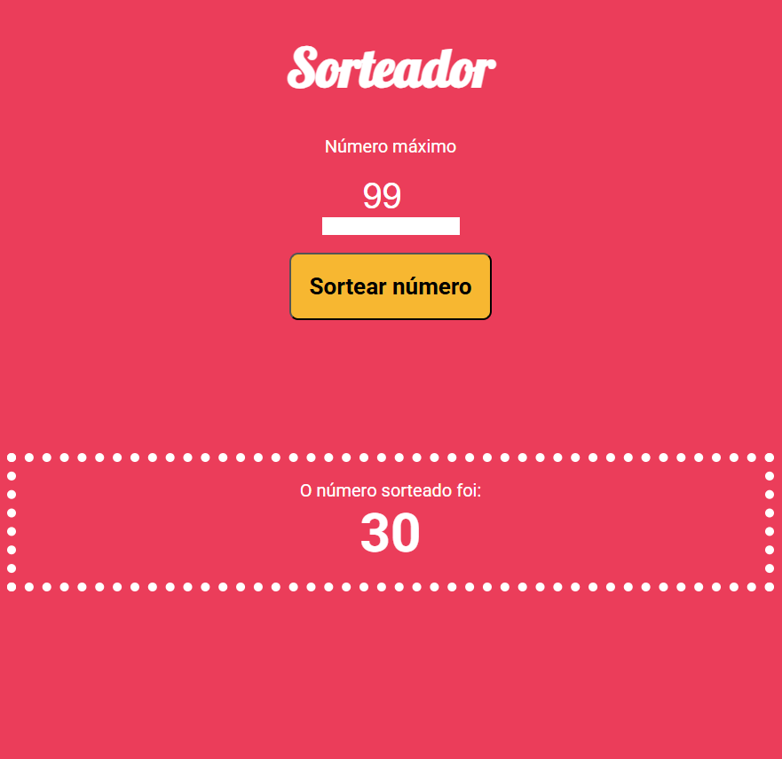

# Sobre o modulo Grunt JS

- Durante o modulo percebi que tem em partes semelhança com modulos anteriores que aprendi sobre SCSS, GULP & LESS. Com GRUNT fiz o processamento e compilação das task runner no projeto de sorteador de números.
- Foi de quande valia o entendimento de criar um projeto que passa por setores de pasta para ter melhor resultado de desenvolvimento.
- Pasta "source" código puro com arquivos não minificados nem comprimidos.
- Pasta de desenvolvimento "dev" Grunt compila o que está em source para cá, sem minificar, facilitando testes e debug.
- Por fim, pasta de produção "dist" Grunt pega os arquivos de dev/, minifica, remove espaços, comprime imagens etc.Com resultado de um codigo leve, otimizado,pronto para subir no servidor

Clique para ver 👇

    <a href="https://sorteador-gruntjs-beige.vercel.app/">
        </img>
    </a>

