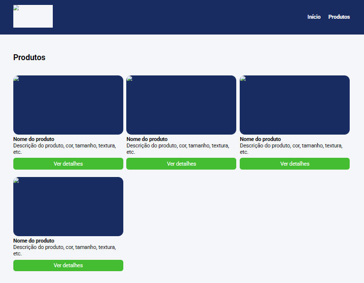

## Modulo-LESS-Atividade
### Atividade

1) Converter o estilo do projeto disponibilizado no Material de apoio para o LESS;
2) Utilizar os recursos do LESS que aprendeu durante o módulo:
variáveis;
divisão dos arquivos;
escapings;
mapas.
3) Crie uma branch chamada exercicio_less no repositório do curso.
4) Armazene os arquivos LESS nesta branch.
5) Envie o link da branch através da plataforma.

##

### OBSERVAÇÃO: 

- Utilizei uma "class" para criar as imagens dentro do página de exemplo da atividade, já que o "placeholder" estava apresentando problemas em mostra a imagem de demonstração, de como ficaria a página com fotos reais

##

        </img>
    </a>

