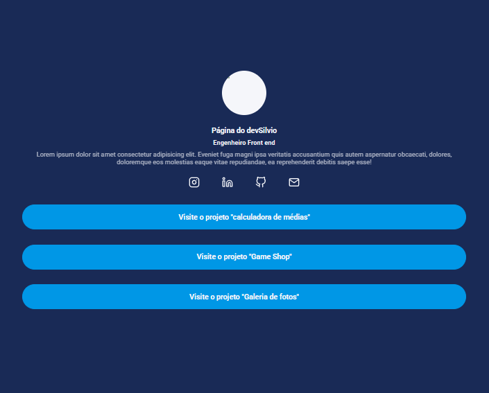

### Sobre LESS

- Gostei muito de utilizar LESS, achei mas fácil que utilizar o "NODE JS" e "GULP" diretamente no projeto as configurações são mais detalhadas, já no LEES foi configurações mais simples e tive resultados ágeis por sua forma de utilização ser descomplicada e de melhor entendimento.
- Com LESS é mais rápido e fácil criar "maps" "mixins" & "escaping", que deixa toda personalização do CSS simples de entender, como fazer todo o processo e também fica mais rapido fazer o projeto.

Clique para ver 👇

    <a href="">
        </img>
    </a>

